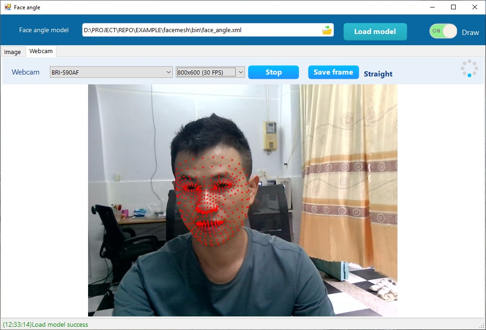

# FaceMesh
FaceMesh là ứng dụng demo viết bằng **C#** cho phép phát hiện **FaceMesh** (lưới khuôn mặt) từ ảnh hoặc webcam.  
Dự án được xây dựng với **Visual Studio 2022** và chỉ hỗ trợ chế độ **x64** trên **Windows 10** trở lên.



💡 Đây là dự án minh họa, thích hợp cho việc học tập và nghiên cứu.

### Yêu cầu hệ thống
- Windows 10 (x64)
- Visual Studio 2022
- .NET Framework / .NET phù hợp (đã cài đặt sẵn trong solution)


### Các chế độ Input
Ứng dụng hỗ trợ 2 loại nguồn vào:

- Ảnh: chọn file ảnh từ máy tính để phát hiện lưới khuôn mặt.

- Webcam: sử dụng webcam kết nối với máy tính để phát hiện lưới khuôn mặt trực tiếp theo thời gian thực.


## Cách sử dụng

### 1. Clone hoặc tải mã nguồn từ GitHub:
```git clone https://github.com/thigiacmaytinh/FaceMesh.git```


### 2. Mở solution:

Chạy file **FaceMesh_UI.sln** bằng Visual Studio 2022.

Lưu ý: chỉ có chế độ x64, các chương trình về Deep Learning chỉ có x64

Nhấn Start (F5) để chạy chương trình.


## Liên hệ

support@viscomsolution.com

0939.825.125
